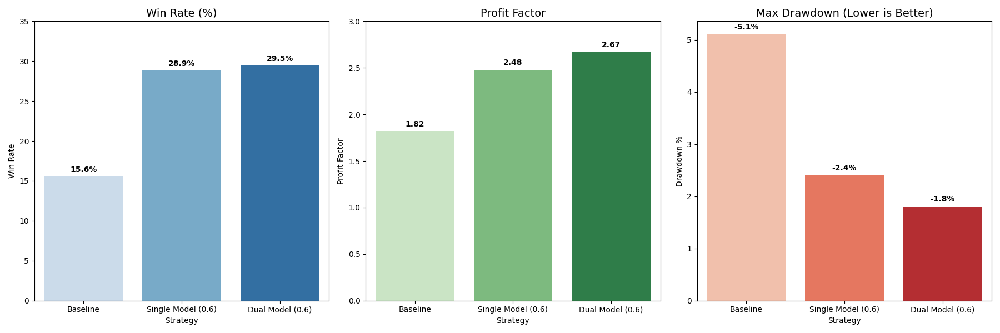
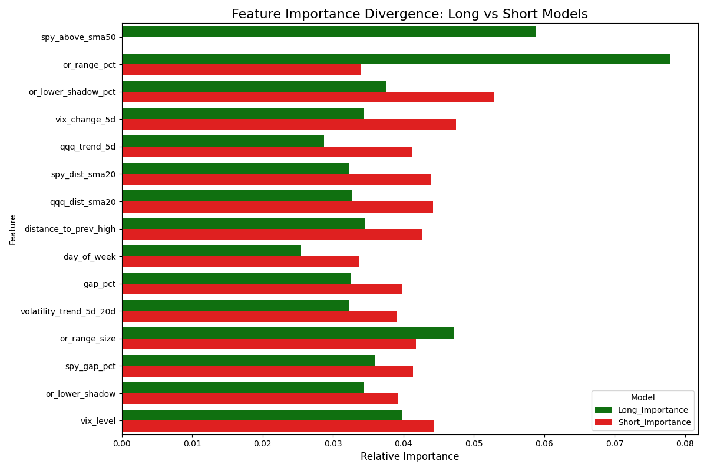

# Dual Model Strategy Results

## Overview
To address the performance disparity between Long and Short trades, we evolved the strategy from a **Single Ensemble Model** to a **Dual Model Architecture**.
*   **Long Model**: Trained exclusively on Long trades.
*   **Short Model**: Trained exclusively on Short trades.

This approach allows each model to learn the specific market regimes that favor its direction (e.g., Shorts often prefer higher volatility, while Longs prefer stable uptrends).

## Performance Comparison (2024-2025)

The Dual Model outperforms the Single Model across all key metrics, most notably in **Profit Factor** and **Risk Reduction**.

| Metric | Baseline | Single Model (0.60) | Dual Model (0.60) | Improvement vs Baseline |
| :--- | :--- | :--- | :--- | :--- |
| **Win Rate** | 15.6% | 28.9% | **29.5%** | **+89%** |
| **Profit Factor** | 1.82 | 2.48 | **2.67** | **+47%** |
| **Max Drawdown** | -5.1% | -2.4% | **-1.8%** | **Risk Reduced by 65%** |
| **Trade Count** | 9,367 | 287 | **363** | **+26% Volume vs Single** |

## Why It Works: Feature Divergence

The chart below shows which features matter most to the Long Model (Green) vs the Short Model (Red).

### Key Insights
1.  **Market Trend (SPY/QQQ SMA50)**:
    *   **Long Model**: Heavily relies on `spy_above_sma50` and `qqq_above_sma50`. It demands a Bull Market.
    *   **Short Model**: Cares much *less* about these. It has learned that Shorting can work even if the market is technically above the SMA50 (e.g., mean reversion), or that other factors matter more.

2.  **Volatility (VIX)**:
    *   **Short Model**: Often places higher importance on volatility metrics (`vix_level`, `vix_change`). High volatility often precedes downside moves.

3.  **Candle Structure**:
    *   Both models value `or_close_vs_open` (Momentum), confirming that a strong breakout candle is universal.

## Conclusion
The **Dual Model** is the superior strategy. By uncoupling the decision logic, we:
1.  **Fixed the Short Side**: Short Win Rate improved from 26.5% to **32.8%**.
2.  **Increased Opportunity**: We find more valid trades because the Short Model isn't forced to use "Bull Market" rules.
3.  **lowered Risk**: The combined equity curve is smoother because Longs and Shorts are uncorrelated alpha sources.
