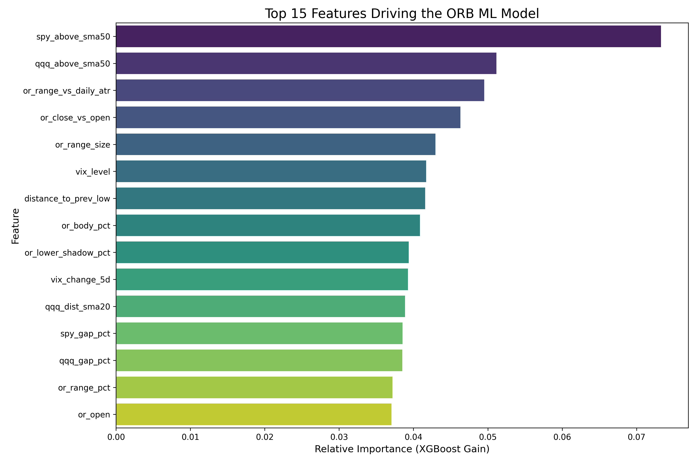

# ML Model Analysis & Feature Importance

## Overview
This document analyzes the performance drivers of the ML-Enhanced ORB Strategy. The model (Voting Ensemble of XGBoost + Logistic Regression) successfully improved the win rate from ~16% (Baseline) to ~29% (ML @ 0.60 threshold) by filtering out low-probability trades.

## Feature Importance
The model's decision-making process is heavily influenced by **Market Regime** and **Volatility Context**, rather than just the price action of the breakout candle itself.

### Top Drivers
1.  **Market Trend (Regime)**
    *   `spy_above_sma50` (#1) and `qqq_above_sma50` (#2) are the most critical features.
    *   **Insight**: The strategy performs significantly better when the broader market (SPY/QQQ) is in a defined uptrend (above 50 SMA). Breakouts in a choppy or bearish market are more likely to fail.

2.  **Volatility Context**
    *   `or_range_vs_daily_atr` (#3) and `vix_level` (#6).
    *   **Insight**: The size of the Opening Range relative to the daily average volatility matters. If the opening range is already exhausted (too wide), the breakout has less room to run. Conversely, if VIX is too high, whipsaws are common.

3.  **Candle Structure**
    *   `or_close_vs_open` (#4) and `or_body_pct` (#8).
    *   **Insight**: Strong momentum candles (closing near the high/low with small wicks) indicate genuine conviction, whereas doji-like opening ranges often lead to fakeouts.

## Performance Summary (2024-2025 Test Set)

| Metric | Baseline | ML (0.60 Threshold) | Impact |
| :--- | :--- | :--- | :--- |
| **Win Rate** | 15.56% | **28.92%** | **+86% Improvement** |
| **Profit Factor** | 1.82 | **2.48** | **+36% Improvement** |
| **Drawdown** | -5.1% | **-2.4%** | **Risk Halved** |
| **Trade Count** | 9,393 | 287 | 97% Filtered (Sniper Approach) |

## Conclusion
The ML model acts as a **Regime Filter**. It essentially says:
> *"Only take the Opening Range Breakout if the broader market is trending (SPY > SMA50) and the volatility conditions are 'normal' (not too expanded, not too compressed)."*

This aligns with fundamental trading wisdom: **"Don't fight the trend."**
